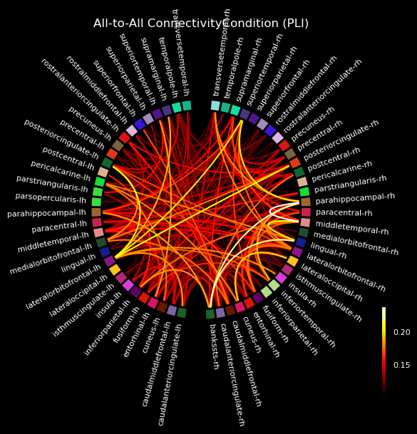
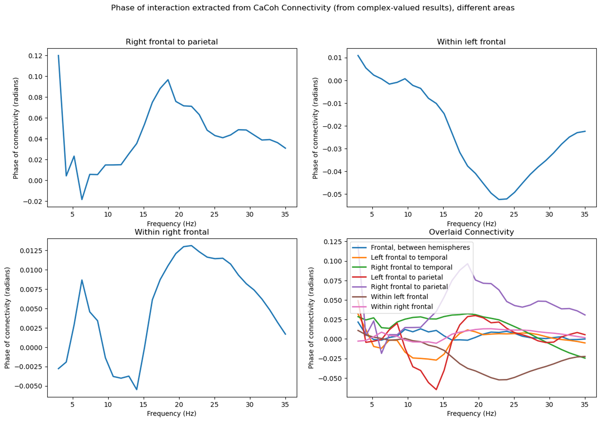

# Automated Connectivity Neuroimaging Analysis Pipeline

A fully automated MNE-Python pipeline for preprocessing, feature extraction, machine learning, and statistical analysis on raw EEG data collected from major depressive disorder (MDD) patients.

## 🧠 Overview

This repository contains a **complete pipeline** for EEG connectivity multivariate analysis. The pipeline automates:
- Data preprocessing → ICA, autoreject, and ECG/EOG artifact removal
- Connectivity analysis → PLI, WPLI, coherence, canonical coherence, and other multivariate methods
- Feature engineering → Pairwise & groupwise connectivity
- Machine learning → Random Forest classification for depression prediction, as well as analysis-ready datasets for RNNs, Logistic Regression, etc.
- Statistical analysis → Epoch-level T-tests on connectivity features

## 🔎 Analytic Pipeline
| **Step** | **Description** |
|----------|-----------------|
| **1. Find All Missing** | Finds. incomplete datafiles or ones with missing MEG data. Generates separate CSVs to sort patients that require additional preprocessing steps. |
| **2. Data Preprocessing Workflow** | Cleans the data, removes heartbeat and ocular artifacts, and drops messy epochs. |
| **3. Rename Files** | Ensures proper naming of files for integrity. |
| **4. Data Cleaning Pairwise** | Structures the data into a dataframe for pairwise analysis. |
| **5. Data Cleaning Groupwise** | Groups the data into brain regions according to the 10-20 system, structuring into a dataframe for groupwise analysis, and produces additional dataframes for descriptive statistics. |
| **6. ML Analysis Connectivity Pairwise** | Conducts connectivity analysis on pairwise data, along with RF grid search. |
| **7. ML Analysis Connectivity Groupwise** | Conducts canonical coherence analysis (or some other custom multivariate method) on groupwise data, along with RF grid search. |
| **8. ML Analysis Connectivity Average** | Conducts canonical coherence analysis (or some other custom multivariate method) on groupwise data, along with RF grid search. |
| **9. ML Analysis TTest** | Runs epoch-level T-testing. |

<br>

Please see [preprocessing_order.md](src/preprocessing_order.md) for more information.

## 📂 Project Structure
```
├───data
│   ├───processed                # Cleaned data, connectivity matrices, ML-ready CSVs
│   └───raw                      # Original EEG/MEG .mat files
├───notebooks 				     # Jupyter notebooks with exploratory data analysis and visualizations
├───relevant-readings            # Relevant literature serving as the source of my analysis and pipeline
├───results                      # Graphs containing results of the relevant connectivity analysis
│   └───preprocessing_examples   # Plots, diagrams, and before-and-after examples of data cleaning
├───scripts                      # Raw versions of the relevant scripts                    
└───src
    └───steps                    # All scripts for each stage in the pipeline
```

## ⚡ Features
- Automatic Preprocessing: Artifact rejection + ICA-based cleaning.
- Connectivity Extraction: Computes multiple EEG connectivity measures.
- Feature Engineering: Supports both pairwise & groupwise feature sets.
- Machine Learning Models: Trains & evaluates classifiers for depression detection.
- Interactive CLI: Choose which step to run from run.py, so you don't have to re-run the entire pipeline every single time!

## 🧪 Example Results

<figure style="display:inline-block; margin: 0 10px;">

<figcaption><b>Figure 1:</b> Pairwise connectivity map using Phase Lag Index (PLI).</figcaption>
</figure>
<br/><br/>
<figure style="display:inline-block; margin: 0 10px;">

<figcaption><b>Figure 2:</b> Multivariate canonical connectivity based on complex-valued CaCOH.</figcaption>
</figure>

## 🚀 Quick Start

1. Clone the repository:
```
git clone https://github.com/Funkey08/Automated-Connectivity-Neuroimaging-Analysis-Pipeline.git
cd Automated-Connectivity-Neuroimaging-Analysis-Pipeline
```
2. Set up the environment:
```
conda env create -f environment.yml
conda activate mne_env
```
3. Run the pipeline:
```
python src/run.py
```

## 📊 Technologies Used

- MNE-Python — EEG preprocessing & connectivity
- scikit-learn — Machine learning & feature selection
- pandas / numpy / scipy — Data wrangling & computation
- matplotlib — Visualization
- autoreject — Automatic artifact rejection
- mne-connectivity — Canonical coherence & network features

## 📄 References

[1] Moreno-Agostino et al., 2021. Global trends in the prevalence and incidence of depression: a systematic review and meta-analysis. Journal of Affective Disorders 281:15 (p. 235-243). https://www.sciencedirect.com/science/article/pii/S0165032720331244   
[2] Simmatis, Russo, et al., 2023. Technical and clinical considerations for electroencephalography-based biomarkers for major depressive disorder.” npj Mental Health Research (2023) 2:18 ; https://doi.org/10.1038/s44184-023-00038-7   
[3] Sakkalis, 2011. Review of advanced techniques for the estimation of brain connectivity measured with EEG/MEG. Computers in Biology and Medicine 41:12(1110-1117). https://www.sciencedirect.com/science/article/pii/S0010482511001405    
[4] Chiarion et al., 2023. Connectivity analysis in EEG data: a tutorial review of the state of the art and emerging trends. Bioengineering 10(3). https://www.mdpi.com/2306-5354/10/3/372    
[5] Fingelkurts et a., 2007. Impaired functional connectivity at EEG alpha and theta frequency bands in major depression. Hum. Brain Map. 28:3 (247-261). https://onlinelibrary.wiley.com/doi/full/10.1002/hbm.20275   
[6] Olbrich et al., 2014. Functional connectivity in major depression: increased phase synchronization between frontal cortical EEG-source estimates. Psych. Res.: Neuroimaging. 222:1-2(91-99). https://www.sciencedirect.com/science/article/pii/S0925492714000523    
[7] Miljevic et al., 2023. Alterations in EEG functional connectivity in individuals with depression: a systematic review. Journal of Affective Disorders. 328(287-302). https://www.sciencedirect.com/science/article/pii/S0165032723001465    
[8] Sizemore et al., 2019. The importance of the whole: topological data analysis for the network neuroscientist. Network neuroscience. 3(3): 656-673. https://direct.mit.edu/netn/article/3/3/656/2178    
[9] Chazal and Michel, 2021. An introduction to topological data analysis: fundamental and practical aspects for data scientists. Frontiers in artificial intelligence 4. https://www.frontiersin.org/journals/artificial-intelligence/articles/10.3389/frai.2021.667963/full?ref=graphusergroup.com    
[10] Xu et al., 2021. Topological data analysis as a new tool for EEG processing. Frontiers in neuroscience 15. https://www.frontiersin.org/journals/neuroscience/articles/10.3389/fnins.2021.761703/full 
